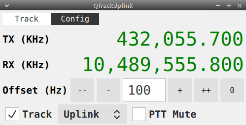

# QTrackUplink for the QO-100 NB transponder

This application uses [Hamlib](https://hamlib.github.io/) to communicate with the uplink transmitter and the downlink receiver.

The current frequency from the uplink transmitter determines the new downlink frequency which is then set
in the downlink receiver.

## The Tracking Tab

The tracking tab shows the current transmitter and receiver frequency.
An optional offset can be applied to the downlink frequency to compensate for frequency errors.

The **Track** checkbox enables or disables uplink frequency tracking.

The **PTT Mute** checkbox enables polling of the uplink transmitter's PTT status. A command is executed on PTT press,
a second command is executed on PTT release. The default settings mute the audio output via pulseaudio while the transmitter
is transmitting.

## The Configuration Tab

**TX (Hz)** and **RX (Hz)** specify a frequency pair which is used to calculate the downlink frequency corresponding to the
current uplink frequency.

The **TX Model** and **RX Model** options are model numbers according to the
[Hamlib supported radios](https://github.com/Hamlib/Hamlib/wiki/Supported-Radios) list.
The list of radios supported by your Hamlib installation can be queried by executing `rigctl -l` in a terminal.

The default settings use an FT-817/FT-818 connected to /dev/ttyUSB0 for uplink and gqrx with default remote control settings
for the  downlink.
